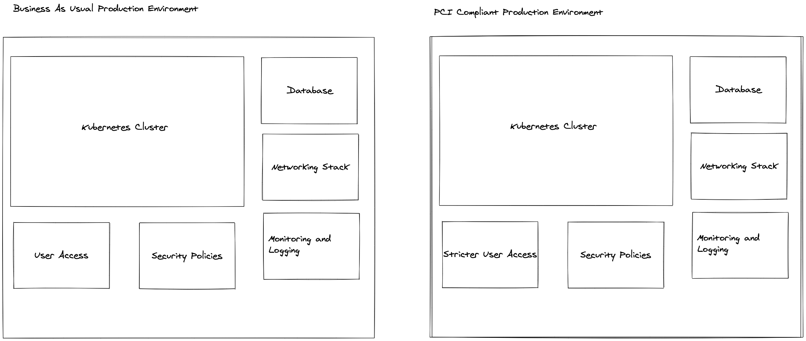
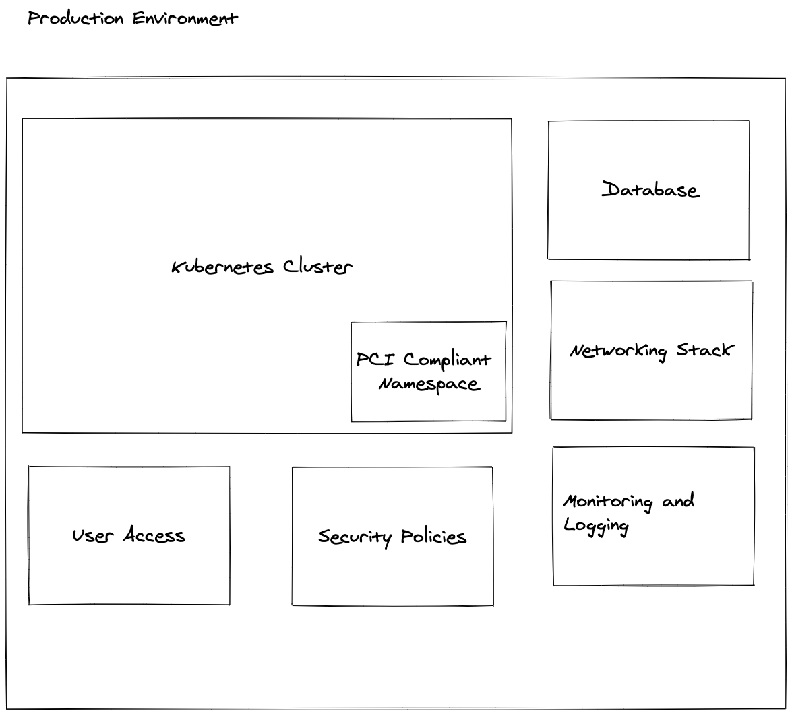

# Cloud Native PCI Compliance

A theoretical example of a multi tenant (or app) cluster with PCI Compliant namespaces that is able to host multiple apps in the same cluster

**NOTE: This is currently a theoretical example and will need to be verified**

## The Problem

When Approaching PCI Compliance a general pattern that is seen is that a company will create a fully seperate system that handles the PCI compliance. This is seen as the "safe method" as if nothing else is in the same place, there is generally less cause for concern. If we take into account Kubernetes this would generally be an entire Kubernetes cluster dedicated to a PCI compliant application. For any person or team that runs Kubernetes clusters at scale, the overhead of running a dedicated cluster might not be optimal, and comes with its own challenges, but what are the other choices?

### First lets start with what is PCI Compliance and why is it important?

The Payment Card Industry Data Security Standard (PCI DSS) is a set of requirements to standradise and ensure that all companies that process, store or transmit card data do so in a secure way. This requirement is governed over by an indpendant body that was created by Visa, MasterCard, American Express, Discover and JCB. In essence the requirements allow for the protection of personal payemnt information for oinline transactions.

### The Normal Way

Having a dedicated cluster might look something along the lines of this:

Key Concerns when looking at this:

- There is a lot of duplicated infrastructure
- The idea behind having a "super secure" application and a normal application creates idea that the normal production enviornment should not be held up to as strict security requirements
- Maintaining and running dual envionrments create cognitive load on the teams responsible
- Deviation in standards can occuer if one environment is more actively developed on

### Proposed Way

The proposed way to handle PCI Compliance is to preferably use Cloud Native Technologies and Metheodologies and to leverage Kubernetes Namespace Segreation to acheive a single Namespace in a Kubernetes Cluster that is PCI compliant. While their are obviously pros and cons to this approach (discussed later) I forsee it leading to a better overall security practice accross the platform and simpler to maintain in the long run.

The proposed solutions would look like this:

Key concerns when looking at this:

- How?
- This might possibly mean that other applications need to adhere to PCI compliance as they are in the same cluster
- Blast radius could affect other applications

## The PCI Compliant Namespace

So in the above diagram we are looking at a single namespace that will be PCI compliant. The security requirements will obviously leak over into other applications (is this a bad thing?) But using Cloud Native Technologies it should be possible. What are the advantages of this setup?

- A single platform (less overhead)
- The PCI Requirements might enforce better practices/standards on other applications
- Increased security
- Allows a platform team to concentrate on improving a single environment in the right direction instead of multiple environments

## How Do We acheive this?

Looking at the PCI compliance checklist it seems at a High level you need to adhere to the following requirements:

- Install and maintain a firewall configuration to protect cardholder data.
- Do not use vendor-supplied defaults for system passwords and other security parameters.
- Protect stored cardholder data.
- Encrypt transmission of cardholder data across open, public networks.
- Use and regularly update anti-virus software.
- Develop and maintain secure systems and applications.
- Restrict access to cardholder data by business need-to-know. Assign a unique ID to each person with computer access. Restrict physical access to cardholder data.
- Track and monitor all access to network resources and cardholder data.
- Regularly test security systems and processes.
- Maintain a policy that addresses information security.

This list is a summation of the actual checklist that has 200 requirements (We will mark this appraoch against all 200) but we will attempt to first see if this approach can acheive the above list.
