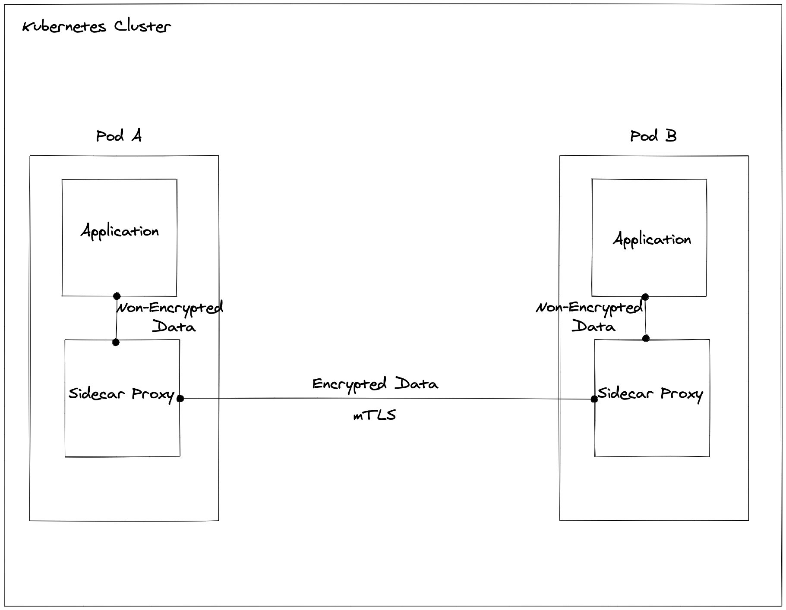
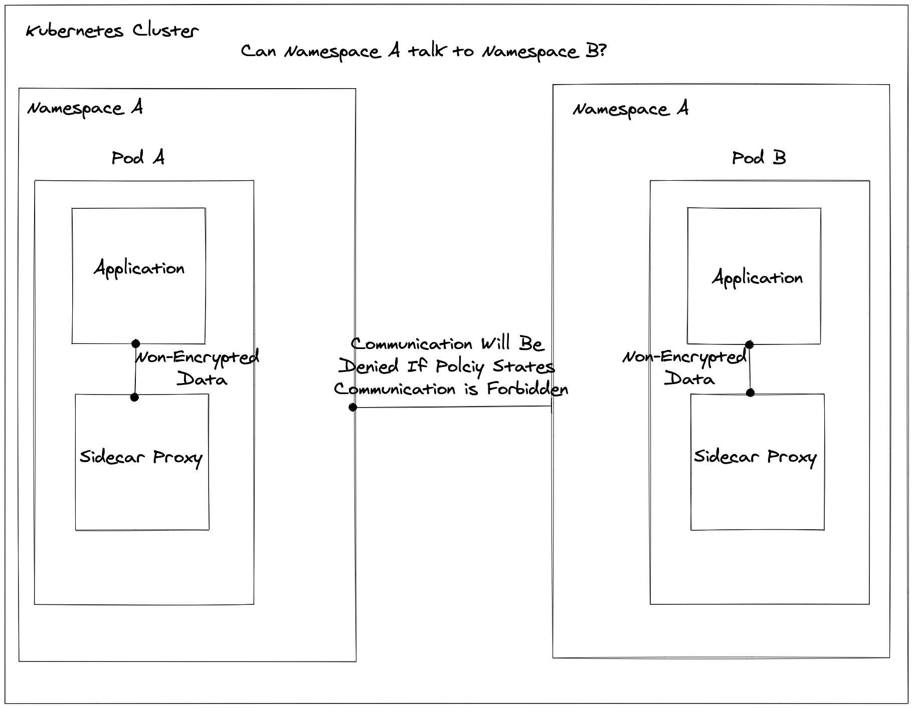
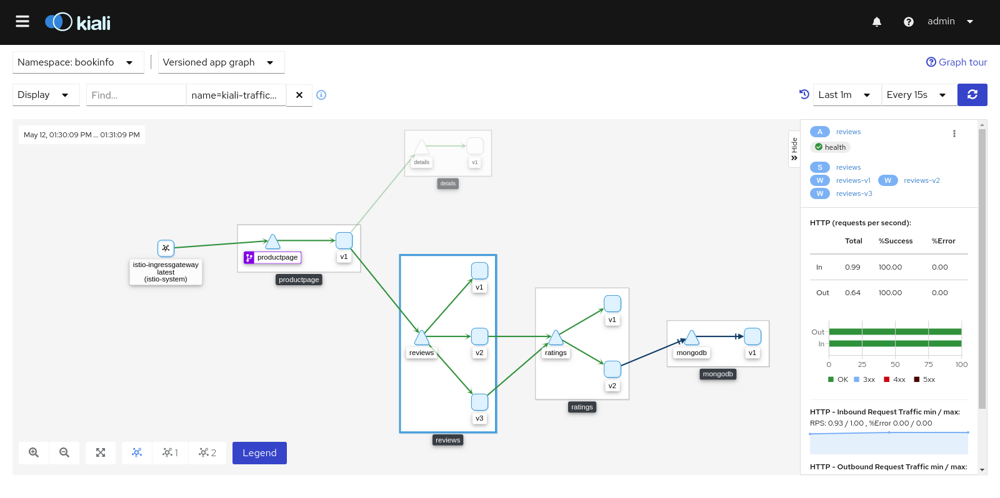

# Networking

Networking in a cluster is always a tricky subject you want to add as little complexity as possible but still need to have it robust enough that you have some semblance of control. This is where service mesh comes into place for a kubernetes cluster.

## Which Service Mesh?

Currently their are two serious contenders in this space LinkerD and Istio. In order to track which one lets look at the criteria we need to fulfil

## Transfering Data in a Secure Manor accross public networks

When dealing with a Secure Kubernetes Cluster it is Generally a Good practice to go with the No Trust Network Mindset, in other words, every other component in the cluster can not be trusted, making the thought that the cluster in itself is a "Public" network. This in essence means that we should be doing best practices like using Encryption between services (commonly known as mTLS). In this case both Istion and LinkerD both support mTLS using the sidecar proxy pattern to make communication for secure. This is generally done with Sidecars rewritting IPTable rules in order to route traffic through the proxy

## Install and maintain a firewall configuration to protect cardholder data

Firewallling is tricky even in the legacy sense. With cluster communication this becomes almost downright impossible. Currenlt LinkerD Does not support this type of functionality (Although it is in the Roadmap). For Istio they have gone to the xtreme on this side, releasing a whole host of Customr Resources that allow and deny communication between pods. One of the simpliest ideas is using an [Authorization Policy](https://istio.io/latest/docs/reference/config/security/authorization-policy/) on the namespace that controls what other namespaces are allowed to communicate with it.

## Track and monitor all access to network

One of the more widely used functionalities of Service Mesh is the monitoring aspect, as all communication goes through Proxy Sidecars by pulling metrics from these side cars you can watch how the traffic is routing throughout your system.

