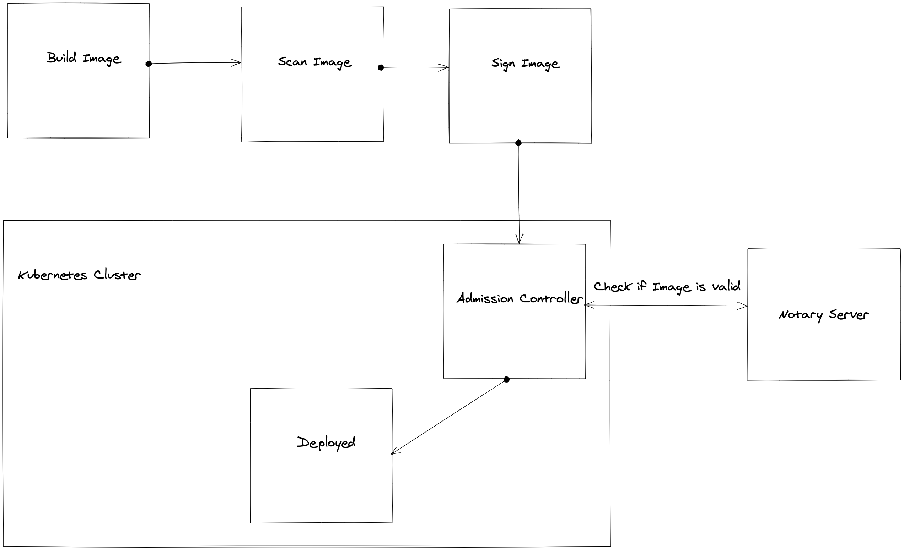
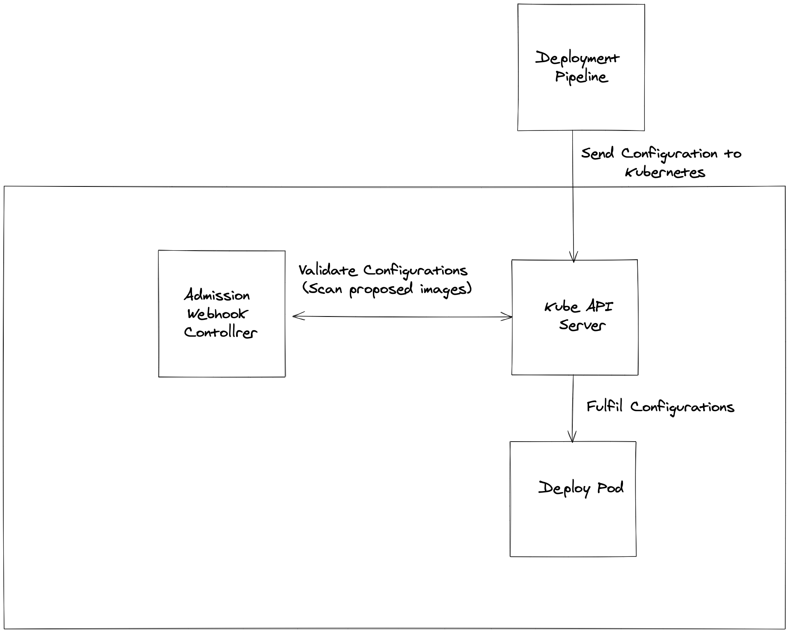
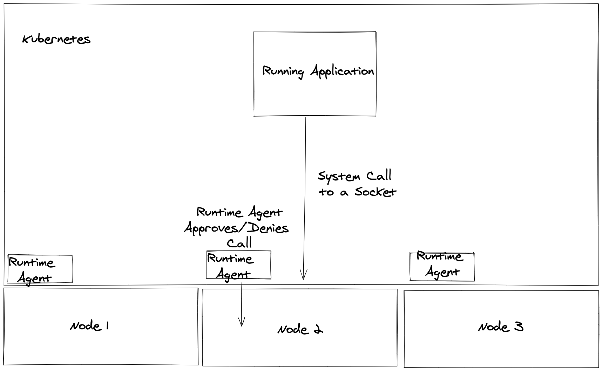

# Vulnerabilities

Scanning software for vulnerabilities shouild always be integrated in your security policies in some form or another, there is also the added extra value of runtime security that notifies system admins or blocks bad actors who have gotten access to a system. For PCI Compliance this is critical as Bad actors generally take advantage of software vulnerabilities to gain access.

## What does this look like in Kubernetes?

For our use case of making a namepsace PCI compliant this has a couple of implications

### CVE scanning

There are currently many CVE scanning tools for containers such as [Trivy](https://github.com/aquasecurity/trivy) or [Clair](https://github.com/quay/clair) that can easily scan containers for CVE's (Common Vulnerabilities). For PCI use case it would make sens to do this at build time (When we are building our containers) and not allowing deployment if the scanners fail. However if this is done in an automation pipeline outside of the system there is always a chance that something can be deployed to a cluster that was not checked. This is a great example of where we can use image signing to verify that deployed images have been checked and use an [admission controller](https://kubernetes.io/docs/reference/access-authn-authz/admission-controllers/) to not allow any copntainers that have not been signed. See [Notary Github](https://github.com/theupdateframework/notary) for how this could look

The workflow would look similar to:

### Admission Webhhok Controller

Kubernetes has a concept know as [Admission Controllers](https://kubernetes.io/docs/reference/access-authn-authz/admission-controllers/). The essential understanding of a Admission Controller is the idea that you have a component in your cluster that runs and verifies the applications that get created in your cluster. This is an ideal situation as it will block any applications that for instance might use images from unverified sources or alternatively scan images before they are deployed to the system. Sysdig seems to have a good implementation of this in their [Anchore Admission Controller](https://github.com/anchore/kubernetes-admission-controller)

### Runtime Scanning

One extra layer of security that can be added to make sure software is only doing what it is supposed to do is runtime scanning. This is where you have a component monitoring all the system calls that each application is making and using policies to allow/deny these calls. This is good for alerting on non-normal behaviour of running applications (for instance if a container starts installing packages like [wget](https://www.gnu.org/software/wget/) or [curl](https://curl.se/) there might be a bad actor).

